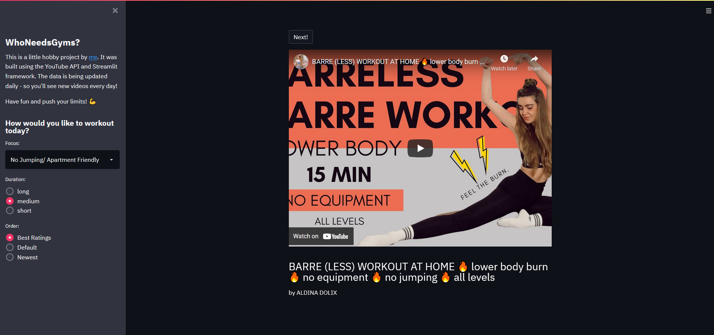
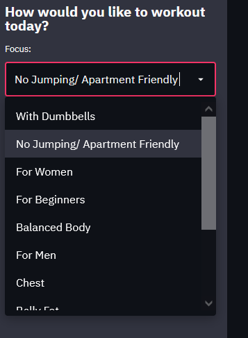

# WhoNeedsGyms?

During the Corona Lockdown I've really gotten into home workouts on YouTube. Since there are countless of different workout types I created this little project as a hobby to get a minimalistic overview and quick access.

It will ask you on what kind of workout you'd like to focus on (e.g. Chest, Using Dumbbells, Apartment friendly workouts with no jumping etc.) and let you decide what lenght the workout should have (short, medium or long).

---

For this project I'm using the YouTube API and the ETL will run on a daily basis. So you can be sure to see new videos every day!

Have fun and push your limits! 💪

---
